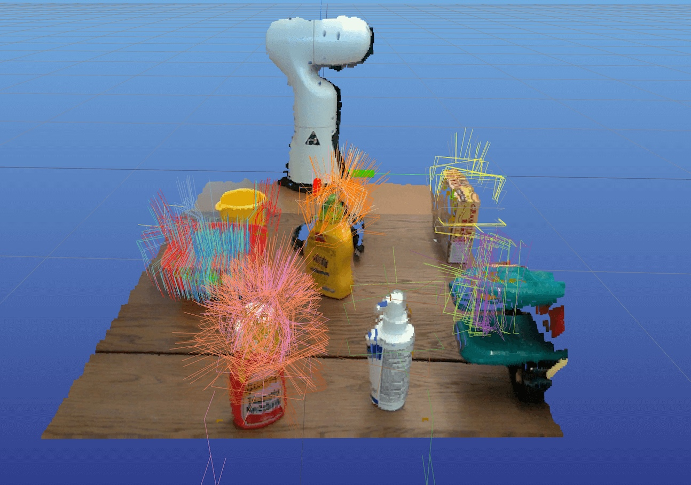

# M2T2: Multi-Task Masked Transformer for Object-centric Pick and Place
### [project website](https://m2-t2.github.io) &emsp; &emsp; [arxiv paper](https://arxiv.org/abs/2311.00926) &emsp; &emsp; [model weights](https://drive.google.com/drive/folders/1qlvHVi1-Jk4ET-NyHwnqZOxALVy9kTO5)


This repository is a fork of M2T2. Please see [README_OLD.md](README_OLD.md) for the original README. This fork includes instructions for installing M2T2 and running it as an inference server.

## Installation

We use [pixi](https://pixi.prefix.dev/) to manage the Python environment and dependencies. If you don't already have it installed, you can run:

```bash
curl -fsSL https://pixi.sh/install.sh | sh
```

Then, follow the instructions below to set up M2T2:

```bash
# Clone the repository
git clone https://github.com/williamshen-nz/M2T2.git
cd M2T2

# Install dependencies (this may take a few minutes)
pixi install
pixi run setup

# Download pretrained weights
pixi run download-weights
```

Next, run the demo script to ensure everything is set up correctly.

```bash
# Run the full demo with meshcat visualization
pixi run demo
```

Go to Meshcat at http://127.0.0.1:7000/static/ in your browser and wait to see the grasp predictions. It should look like the figure below.



After you've verified it's working, press `Ctrl+B`, then `D` to detach from the tmux session. The script will automatically tear down and exit.

## Running the Inference Server

Make sure you're in the project root directory, then run:

```bash
# Start the server (default: listens on all interfaces at http://0.0.0.0:8123)
pixi run server
```

**Other options:**

```bash
# See all options
pixi run server --help

# Run server locally on port 1234
pixi run server --host 127.0.0.1 --port 1234
```

## Citation

If you find this work useful, please cite the original paper:

```bibtex
@inproceedings{yuan2023m2t2,
  title     = {M2T2: Multi-Task Masked Transformer for Object-centric Pick and Place},
  author    = {Yuan, Wentao and Murali, Adithyavairavan and Mousavian, Arsalan and Fox, Dieter},
  booktitle = {7th Annual Conference on Robot Learning},
  year      = {2023}
}
```